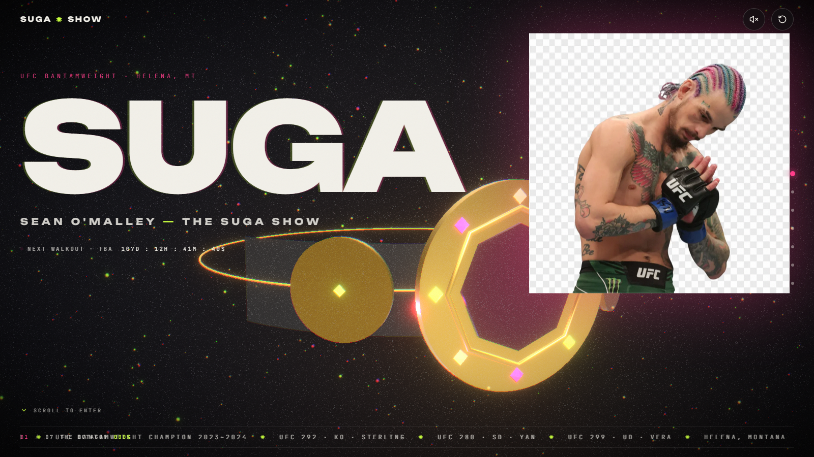
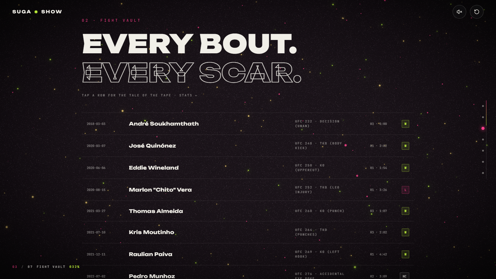
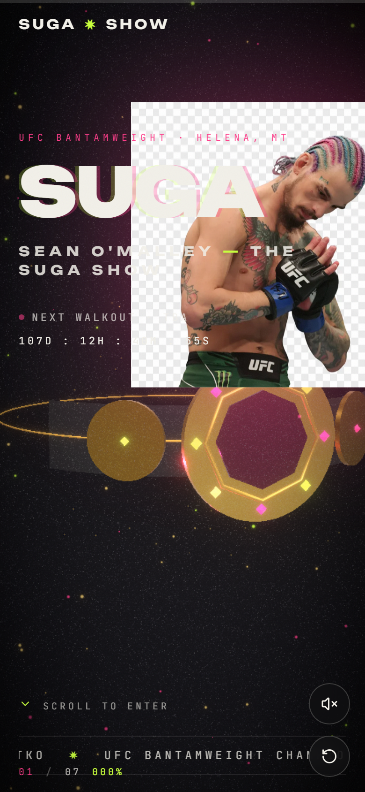

# SUGA — Sean O'Malley · The Suga Show

A cinematic 3D fan-concept experience. One pitch-black scroll: a procedural UFC championship belt you steer with your cursor, rain-washed photography, a fight vault you can open, a TimboSugarShow with audio-reactive bars, a drag-to-scroll fit check and a hover-to-reveal streetwear grid. Unofficial — built with love and brutalist type.

> **Disclaimer:** Unofficial fan concept. Not affiliated with Sean O'Malley or the UFC.





## The user's vision (source of truth)

> *"A hyper-concentrated, Awwwards-caliber site for Sean O'Malley using Lando Norris's technical framework. Color: pitch black `#111112` baseline + hits of Neon Pink, Lime Green and Iridescent Gold (hair + kit). Type: brutalist ultra-wide sans (Druk/Formula vibes — here **Unbounded**) + technical monospace (JetBrains Mono). Textures: VHS glitch, metallic gradients, grainy streetwear photography. Mechanics: a 3D cursor-tracked hero (UFC Championship Belt / custom gloves), scroll-triggered cinematics over photography, and a Fit Check drag-to-scroll carousel. Architecture: Home (The Octagon, belt + countdown + record marquee), TimboSugarShow (LIVE indicator + audio-reactive visualizer), Fight Vault (brutalist timeline → full-screen modal with striking stats) and Suga Merch (hover-to-reveal flat → modelled)."*

The master brief's default concept was **LUMEN** — a deep-sea dive with whale / jellyfish / coral. The build honours the replacement vision above (the adaptation is logged in `DECISIONS.md` and this section takes precedence by master-prompt §1).

Three adjectives used as the tiebreaker for every call: **brutalist · iridescent · visceral**.

## User media — how every upload was used

Nine of twelve `assets_upload/` files were shipped — one is the **main image** (`Documents/newim.jpg` · the user's studio face portrait) shown as the big Legacy exhibit and the Braids Cap merch alt. The rest:

- **main-poster** — legacy alt + merch + EndCard collage
- **octagon-arms / celebrate-alt** — EndCard collage + prints
- **collage** — fit check + merch + EndCard wash
- **praying-cutout** (transparent) — hero floating cutout beside the belt (alpha preserved)
- **fight-stance / teal-portrait / walkout-jacket** — Fit Check cards, podcast portrait, jacket merch

Two files (a bloodied fight photo at 33 KB ×2 — `images-12/13a`) and the 25 MB screen recording were excluded — the first on all-ages grounds, the second for the video budget/no-ffmpeg — and are logged in `docs/asset-manifest.md`. Every other upload is visible. Run `npm run assets` to re-optimise after adding files.

## Inspiration

Primary: **landonorris.com** — its vertical "drive" lock, next-race capsule, relentless ticker and helmet Hall of Fame carousel taught the build's scrolling posture and merch logic. The remaining sites set the bar: **bruno-simon.com** (playful interactivity), **lusion.co** (particle bloom), **chartogne-taillet.com** (inertia as narrative), **activetheory.net** (curtain loads), **unseen.co** (restraint). Full Feel Rules (ten, each cited) live in `docs/inspiration-notes.md`.

## Tech & tools (hackathon list coverage marked ✅)

| Layer | Choice | Hackathon list |
| --- | --- | --- |
| Build | Vite 5 (React template) | — |
| Language | TypeScript strict | — |
| Framework | React 18.3 | — |
| 3D | Three.js `0.170` via `@react-three/fiber` `8.17` | ✅ Three.js · ✅ React Three Fiber · ✅ WebGL |
| R3F helpers | `@react-three/drei` (Sparkles, PerformanceMonitor) | ecosystem |
| Post | `@react-three/postprocessing` (Bloom, Vignette, Noise, ChromaticAberration via `postprocessing` 6.36) | WebGL pipeline |
| Smooth scroll | `lenis` `1.1` | — |
| Scroll/animation | `gsap` + `@gsap/react` (`ScrollTrigger`, `useGSAP`) | ✅ GSAP |
| DOM motion | `framer-motion` (Loader, HUD, modals, drag springs) | ✅ Framer Motion |
| State | `zustand` (experience store + `worldState` ref for per-frame values) | — |
| Styling | Tailwind CSS `3.4` + custom glow/glitch/grain/vignette | — |
| Fonts | `@fontsource-variable/unbounded + space-grotesk + jetbrains-mono` | OFL |
| Icons | `lucide-react` | open source |
| Asset pipeline | `sharp` (WebP ≤200 KB, ≤1600 px) + `scripts/generate-og.mjs` | — |
| Screenshots | `playwright` + Chromium (`scripts/screenshot.mjs`) | — |
| Hosting target | Vercel / Netlify free tier (static `dist/`) | free tier |

No paid software, APIs, subscriptions or licensed assets — and no audio files (ambience is synthesized with Web Audio, **off by default**).

## Local run

```bash
npm install
npm run assets        # optimise assets_upload/ → public/images/ + docs/asset-manifest.md
npm run og            # generate public/og-image.jpg + public/apple-touch-icon.png
npm run dev           # http://localhost:5173
npm run build         # tsc + vite → dist/
npm run preview       # serve dist/ at http://localhost:4173
```

The static site in `dist/` can be deployed to any static host (`dist/public` is not used — `public/` files are copied to `dist/` at the root).

## License / reuse

Code (`src/`) is MIT. User-supplied photography is user-owned; Sean O'Malley likeness & fight records are public sporting facts shown under an "unofficial fan concept" disclaimer (footer). Fonts are OFL; icons are ISC/MIT. Replace the disclaimer if you actually license the likeness.
